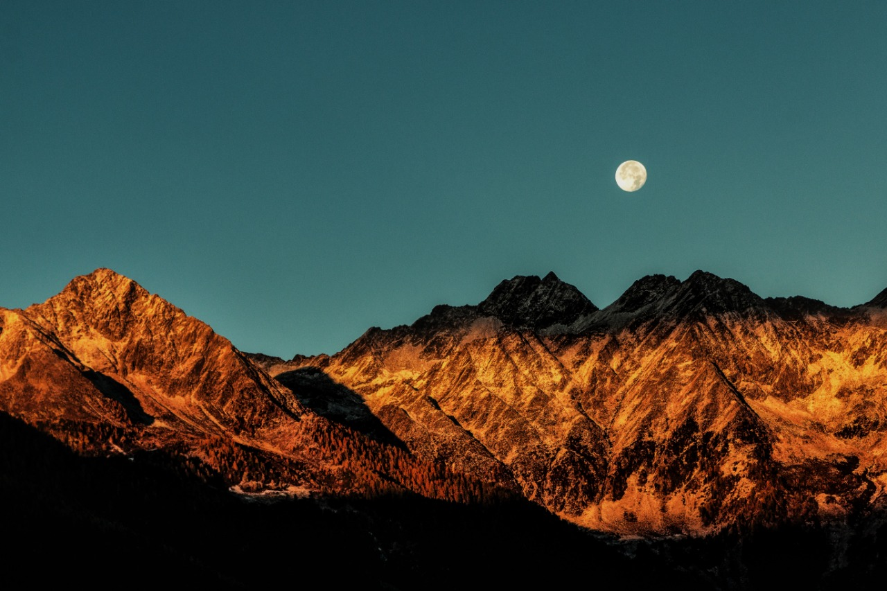

# LowpolyRxJava Android

An android library to convert your dull normal images into awesome ones with a crystallized lowpoly effect.
 

## Table of Contents
- [Introduction](#introduction)
- [Samples](#samples)
- [Insights](#insights)
- [Installation](#installation)
- [Usage Example](#usage-example)
- [How to Contribute](#how-to-contribute)

## Introduction
LowpolyRxJava serves as an improvement over this <a href="https://github.com/xyzxqs/XLowPoly">repository</a> by 
 - providing better quality results.
 - provides wider choice of input sources like file path, bitmap or drawable resource.
 - natively using RxJava for background processing thereby reducing boilerplate code on the developer's end.

## Samples

  
  

							  

  
  

							  

  
  

							  

  
  

							  

  
  

## Insights

 - LowpolyRxJava uses [JNI](#jni) with 64 bit support to meet google specified requirement for all apps to be 64 bit enabled by August 2019.
 - Use of [JNI](#jni) enables much faster execution than other similar libraries.
 - Use of [Sobel Operator](#sobel-operator) for edge deteaction.
 - Use of [Delaunay Triangulation](#delaunay-triangulation) on the result from the sobel operator to construct the final crsystallized effect on the image. 
 
 ### JNI
 
 
 ### Sobel Operator
 
 A very common operator for doing this is a Sobel Operator, which is an approximation to a derivative of an image. It is separate in the y and x directions. If we look at the x-direction, the gradient of an image in the x-direction is equal to this operator here. We use a kernel 3 by 3 matrix, one for each x and y direction. The gradient for x-direction has minus numbers on the left hand side and positive numbers on the right hand side and we are preserving a little bit of the center pixels. Similarly, the gradient for y-direction has minus numbers on the bottom and positive numbers on top and here we are preserving a little bit on the middle row pixels.
 
 
 ### Delaunay Triangulation
 
 The triangulation algorithm is named after Boris Delaunay for his work on this topic from 1934. In mathematics and computational geometry, a Delaunay triangulation (also known as a Delone triangulation) for a given set P of discrete points in a plane is a triangulation DT(P) such that no point in P is inside the circumcircle of any triangle in DT(P). These triangles inturn provide us with the crystallized image.
 
 

 
 Which leads to the resultant crystallized image as :-
 

 Credits : <a href="https://en.wikipedia.org/wiki/Delaunay_triangulation>Wikipedia</a>

 
## Installation

Step 1. Add the JitPack repository to your build file

Add it in your root build.gradle at the end of repositories:

	allprojects {
		repositories {
			...
			maven { url 'https://jitpack.io' }
		}
	}
  
  Step 2. Add the dependency

	dependencies {
	        implementation 'com.github.abhriyaroy:LowpolyRxJava:1.0.1'
	}

That's it!!  

Please note that using this library, it is assumed that RxJava and RxAndroid are already added as dependencies in your project but incase, you don't have these dependencies, please add the following dependencies to your `app/build.gradle` file :-
	
	dependencies{
		...
		// Rx java
  		implementation "io.reactivex.rxjava2:rxjava:$LATEST_RX_JAVA_VERSION"
  		// Rx android
  		implementation "io.reactivex.rxjava2:rxandroid:$LATEST_RX_ANDROID_VERSION"
	}

## Usage Example

##### Kotlin way -  

	private fun generateLowpoly(originalBitmap: Bitmap): Single<Bitmap> {
		return LowPoly.generate(originalBitmap)
		 // Observe on thread according to your need
      		.observeOn(AndroidSchedulers.mainThread())
	}
	
##### Java way -  
  
	private Single<Bitmap> generateLowpoly(Bitmap originalBitmap){
	   	 return LowPoly.generate(originalBitmap)
	    	 	// Observe on thread according to your need
      		.observeOn(AndroidSchedulers.mainThread())
	}
	
 

###### A full implementation is in the app module of this repository.

## How to Contribute

Please feel free to raise an issue incase you come across a bug or even if you have any minor suggestion. Also please raise a Pull Request if you've made any improvements which you feel should be incorporated into this library.

## About the Author
### Abhriya Roy

Android Developer with 2 years of experience in building apps that look and feel great. 
Enthusiastic towards writing clean and maintainable code.
Open source contributor.

 &nbsp;
 
&nbsp;
 
&nbsp;

 

## License

    Copyright 2019 Abhriya Roy

    Licensed under the Apache License, Version 2.0 (the "License");
    you may not use this file except in compliance with the License.
    You may obtain a copy of the License at

       http://www.apache.org/licenses/LICENSE-2.0

    Unless required by applicable law or agreed to in writing, software
    distributed under the License is distributed on an "AS IS" BASIS,
    WITHOUT WARRANTIES OR CONDITIONS OF ANY KIND, either express or implied.
    See the License for the specific language governing permissions and
    limitations under the License.