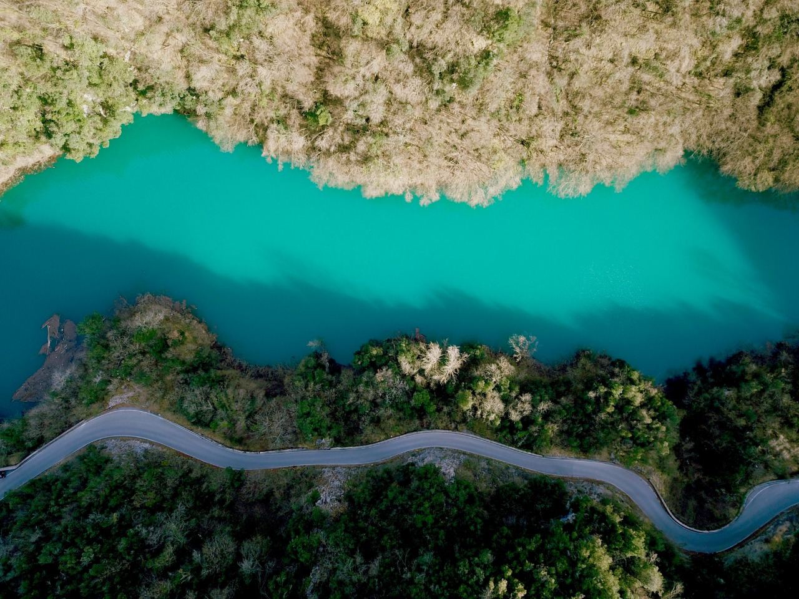
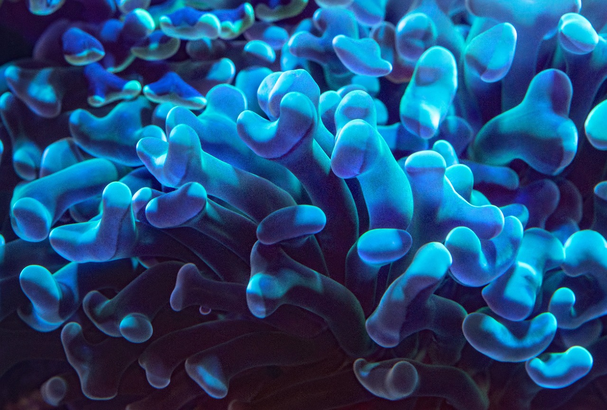
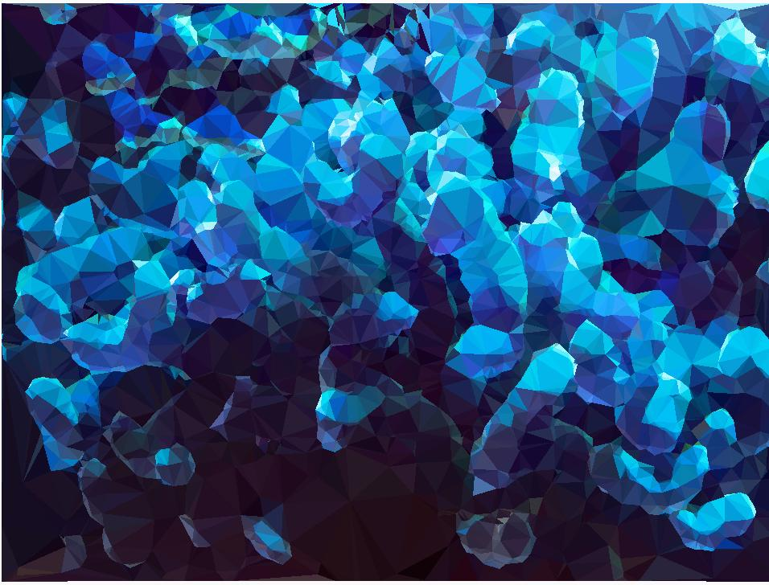
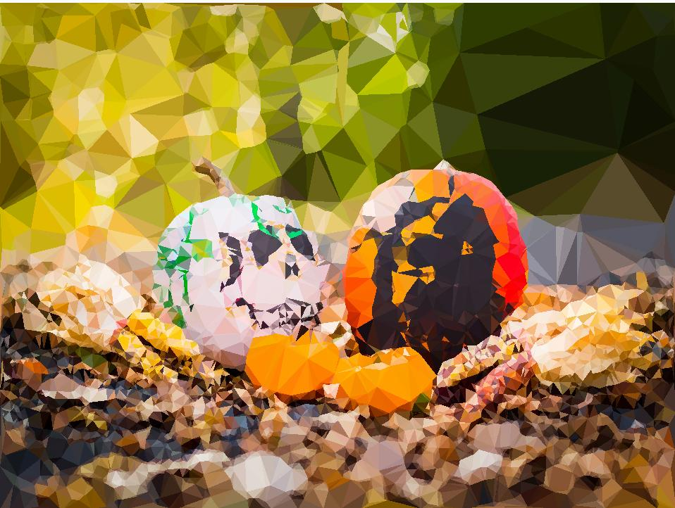
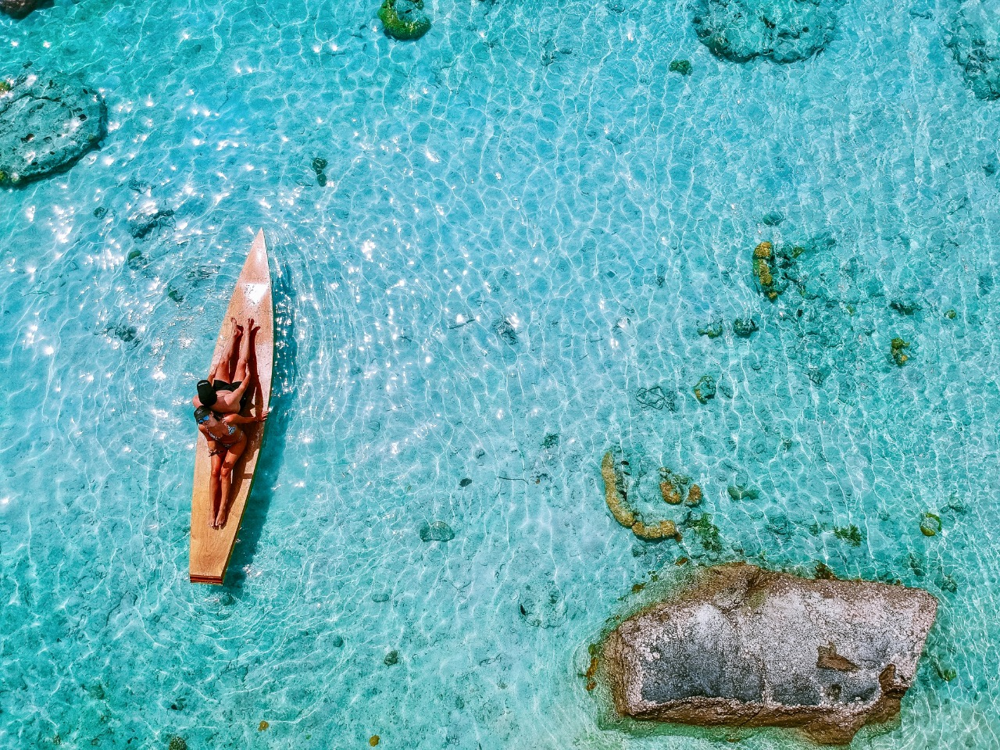
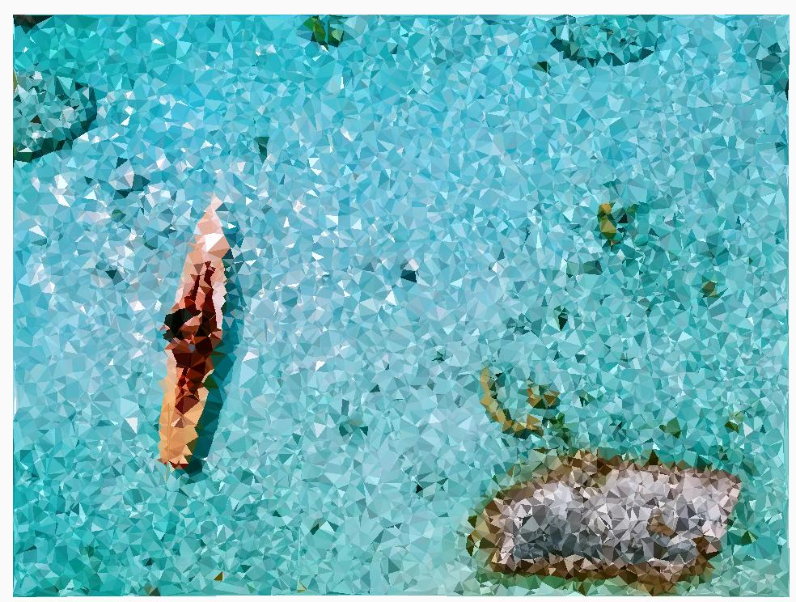
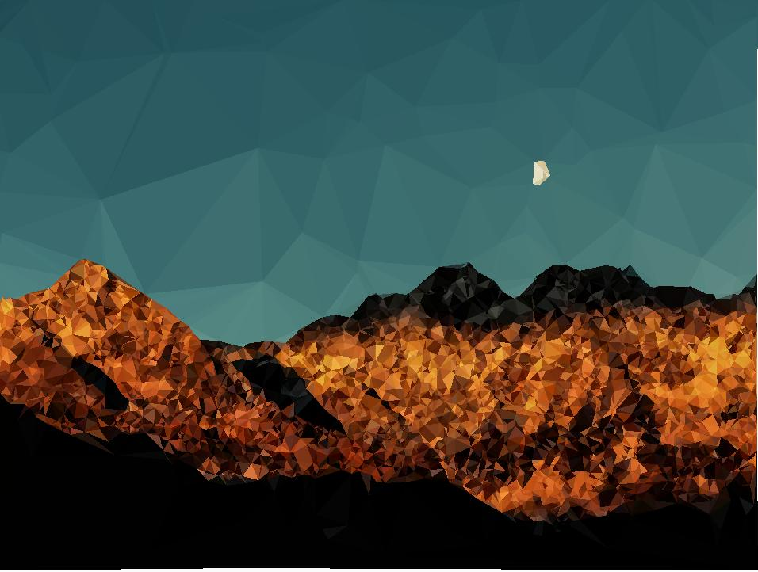

# LowpolyRxJava Android

An android library to convert your dull normal images into awesome ones with a crystallized lowpoly effect.
This is feature of WallR android app - https://play.google.com/store/apps/details?id=zebrostudio.wallr100&hl=en

## Samples

  
  

 

  
  

 

  
  

 

  
  

 

  
  

# Installation

Step 1. Add the JitPack repository to your build file

Add it in your root build.gradle at the end of repositories:

	allprojects {
		repositories {
			...
			maven { url 'https://jitpack.io' }
		}
	}
  
  Step 2. Add the dependency

	dependencies {
	        implementation 'com.github.abhriyaroy:LowpolyRxJava:1.0'
	}

That's it!!

If you do like my work, don't forget to hit the star button.
If you have any ideas to improve upon my work feel free to raise a PR and let's learn together. :)
